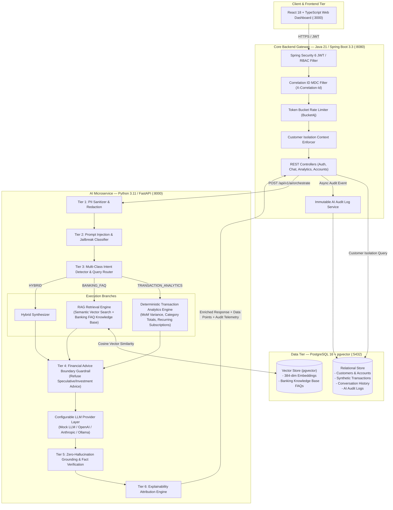
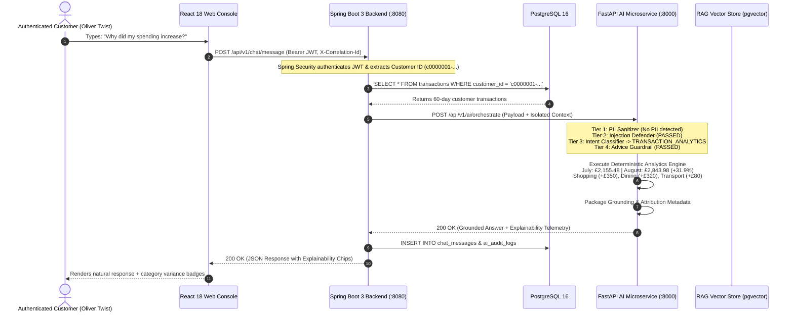

# FinAssist — Secure GenAI Personal Banking Assistant

[](https://github.com/Ansooo7/finassist-banking-assistant)
[](https://www.oracle.com/java/)
[](https://spring.io/projects/spring-boot)
[](https://www.python.org/)
[](https://fastapi.tiangolo.com/)
[](https://reactjs.org/)
[](https://github.com/pgvector/pgvector)
[](https://fca.org.uk)

> **Production-Style Educational Portfolio Project**  
> *Demonstrating Generative AI, Retrieval-Augmented Generation (RAG), Deterministic Financial Analytics, Spring Boot 3 Microservices, and Multi-Tier AI Safety Guardrails for Regulated Banking Institutions.*

---

## 1. Executive Summary & Business Problem

Modern retail and commercial banking customers demand conversational, natural language access to their financial telemetry. However, deploying Large Language Models (LLMs) in regulated financial institutions presents critical risks:
1. **Financial Advice Hallucinations**: Speculative investment/crypto recommendations violating Financial Conduct Authority (FCA) regulations.
2. **Class & Arithmetic Hallucination**: LLMs are notoriously inaccurate at mathematical summation and category aggregation over large transaction ledgers.
3. **Cross-Customer Data Exfiltration**: Prompt injection attacks attempting to exfiltrate other customers' balances or system instructions.
4. **PII Leakage**: Transmission of payment card PANs and bank sort codes to third-party model providers.

### The FinAssist Solution
FinAssist solves these enterprise challenges through a **Hybrid Deterministic-RAG Architecture**:
- **Deterministic Calculation Engine**: All mathematical calculations (month-over-month variances, category distributions, recurring subscription detection) are computed via verifiable mathematical algorithms rather than probabilistic LLM token generation.
- **Controlled Banking Policy RAG**: Vector-indexed knowledge base covering account mandates, UK Faster Payments rules, daily contactless limits (£100 limit, cumulative £300 PIN challenge), international SWIFT fees, and dispute procedures.
- **6-Tier AI Safety Guardrail Pipeline**: PII sanitization, prompt injection defense, financial advice boundary enforcement, hard customer SQL isolation, and transparent explainability attribution attached to every response payload.

---

## 2. System Architecture



---

## 3. End-to-End Query Sequence Diagram



---

## 4. Multi-Tier AI Safety & Guardrails Pipeline

| Tier | Guardrail Layer | Threat Model & Mitigation Strategy | Action on Violation |
| :--- | :--- | :--- | :--- |
| **Tier 1** | **PII Redactor & Sanitizer** | Prevents transmission of 16-digit card PANs, UK Sort Codes (`20-45-14`), and phone numbers to downstream LLMs. | Replaces tokens with `[CARD_REDACTED_****9012]` before parsing. |
| **Tier 2** | **Prompt Injection Defense** | Blocks instruction overrides, DAN persona hijacking, system prompt extraction, and cross-customer query tampering. | Halts execution immediately; returns safe security disclaimer; logs high-severity audit event. |
| **Tier 3** | **Customer Isolation Boundary** | Prevents horizontal privilege escalation and cross-account data leakage. | Hard database query enforcement (`WHERE customer_id = :authCustomerId`). |
| **Tier 4** | **Financial Advice Boundary** | Detects prohibited speculative stock picking, crypto recommendations, and get-rich schemes (FCA compliance). | Gracefully refuses advice; outputs standard FCA regulatory disclaimer and adviser referral. |
| **Tier 5** | **Zero-Hallucination Grounding** | Ensures claims map directly to verified SQL analytics or retrieved FAQ documents. | Refuses ungrounded or speculative responses. |
| **Tier 6** | **Explainability Attribution** | Every response returns structured `data_points_used` and `retrieved_faq_sources`. | Displays interactive visual chips in the UI. |

---

## 5. Synthetic Banking Knowledge Base (RAG Domains)

1. **Account Policies (`KB-ACC`)**: Arranged overdraft allowances (£1,000 limit with £25 fee-free buffer, 19.9% EAR), statement exports (PDF/CSV 7-year retention), and tax certificates.
2. **Payment Regulations (`KB-PAY`)**: UK Faster Payments (£25k single, £50k daily limit, instant 15-second settlement), SWIFT international transfers (£9.50 fee, 0.45% FX margin, 1-3 days), and Direct Debit statutory guarantee.
3. **Card Controls (`KB-CRD`)**: Contactless payment limits (£100 per tap, £300 cumulative PIN reset challenge), biometric mobile wallet exemptions (Apple/Google Pay), and in-app card freezing.
4. **Security & Anti-Fraud (`KB-SEC`)**: 24/7 fraud reporting hotline (`0800-012-3456`), phishing awareness protocols (bank will never ask for PIN/OTP).
5. **Dispute & Chargeback (`KB-DSP`)**: Visa/Mastercard chargeback claims (up to 120 days from transaction), duplicate charge resolution SLA (10-14 business days).

---

## 6. Deterministic Financial Analytics Formulas

$$\text{MoM Spend Delta} = \text{Spend}_{\text{Current Month}} - \text{Spend}_{\text{Previous Month}}$$

$$\text{Percentage Change} = \left( \frac{\text{MoM Spend Delta}}{\text{Spend}_{\text{Previous Month}}} \right) \times 100$$

$$\text{Category Share} = \left( \frac{\text{Category Spend}}{\text{Total Month Spend}} \right) \times 100$$

---

## 7. REST API Endpoints

### Authentication & Customer Profiles
- `POST /api/v1/auth/login`: Authenticate and issue HMAC-SHA512 JWT.
- `POST /api/v1/auth/register`: Create user and linked customer bank account.
- `GET /api/v1/customers/me`: Retrieve customer profile, sort codes, account numbers, and balances.

### Conversational AI & Banking Telemetry
- `POST /api/v1/chat/message`: Submit natural language queries to the GenAI Banking Assistant with full explainability.
- `GET /api/v1/chat/history?sessionId=...`: Retrieve message history for a conversation session.
- `GET /api/v1/analytics/spending-summary`: Return month-over-month variances, category breakdowns, and recurring subscriptions.
- `GET /api/v1/transactions/my-transactions`: Return paginated transactions with customer data isolation.

### AI Microservice Direct Endpoints (`ai-service` on `:8000`)
- `POST /api/v1/ai/orchestrate`: Multi-tier guardrail execution, intent routing, and grounded LLM response synthesis.
- `POST /api/v1/ai/guardrails/evaluate`: Standalone guardrail evaluator for security auditing and sandbox test bench.
- `GET /health`: Service health, vector store index count, and active LLM provider.

---

## 8. Automated Test Suite Results

```
============================= PyTest Test Suite (Python AI Service) =============================
tests/test_analytics_engine.py::test_monthly_totals_calculation PASSED                 [  5%]
tests/test_analytics_engine.py::test_category_breakdown PASSED                         [ 11%]
tests/test_analytics_engine.py::test_mom_variance_comparison PASSED                    [ 16%]
tests/test_analytics_engine.py::test_recurring_subscription_detection PASSED           [ 22%]
tests/test_analytics_engine.py::test_largest_transactions PASSED                       [ 27%]
tests/test_guardrails.py::test_pii_sanitization_card_pan PASSED                        [ 33%]
tests/test_guardrails.py::test_pii_sanitization_sort_code PASSED                       [ 38%]
tests/test_guardrails.py::test_prompt_injection_jailbreak_defense PASSED               [ 44%]
tests/test_guardrails.py::test_benign_banking_queries_not_flagged_as_injection PASSED [ 50%]
tests/test_guardrails.py::test_financial_advice_boundary_refusal PASSED                [ 55%]
tests/test_guardrails.py::test_normal_spending_questions_not_flagged_as_advice PASSED [ 61%]
tests/test_orchestration_api.py::test_health_endpoint PASSED                           [ 66%]
tests/test_orchestration_api.py::test_orchestrate_analytics_query PASSED               [ 72%]
tests/test_orchestration_api.py::test_orchestrate_prompt_injection_blocked PASSED     [ 77%]
tests/test_orchestration_api.py::test_guardrails_evaluate_endpoint PASSED             [ 83%]
tests/test_rag_retrieval.py::test_rag_retrieval_contactless_limit PASSED               [ 88%]
tests/test_rag_retrieval.py::test_rag_retrieval_fraud_reporting PASSED                 [ 94%]
tests/test_rag_retrieval.py::test_rag_retrieval_international_wire PASSED             [100%]
================================= 18 passed in 1.28s ==================================
```

```
=========================== JUnit 5 & Mockito (Spring Boot 3 Backend) ===========================
[INFO] Running com.finassist.security.JwtServiceTest
[INFO] Tests run: 1, Failures: 0, Errors: 0, Skipped: 0, Time elapsed: 0.426 s
[INFO] Running com.finassist.service.ChatOrchestrationTest
[INFO] Tests run: 1, Failures: 0, Errors: 0, Skipped: 0, Time elapsed: 1.433 s
[INFO] Running com.finassist.service.CustomerIsolationTest
[INFO] Tests run: 1, Failures: 0, Errors: 0, Skipped: 0, Time elapsed: 0.084 s
[INFO] 
[INFO] Results:
[INFO] Tests run: 3, Failures: 0, Errors: 0, Skipped: 0
[INFO] BUILD SUCCESS
```

---

## 9. Quick Start Guide

### Option 1: Full Multi-Container Docker Stack
```bash
# 1. Clone repository
git clone https://github.com/Ansooo7/finassist-banking-assistant.git
cd finassist-banking-assistant

# 2. Build & Launch via Docker Compose
docker-compose up --build
```
- React Dashboard: `http://localhost:3000`
- Spring Boot Backend: `http://localhost:8080/swagger-ui.html`
- FastAPI AI Microservice: `http://localhost:8000/docs`

### Option 2: Local Native Development
```bash
# 1. Start Python AI Microservice
cd ai-service
pip install -r requirements.txt
python -m uvicorn app.main:app --port 8000

# 2. Start Spring Boot Backend
cd ../backend
mvn spring-boot:run "-Dspring-boot.run.profiles=standalone"

# 3. Start React Frontend
cd ../frontend
npm install
npm run dev
```

### Demo Accounts
| Username | Password | Role | Customer Number | Current Balance |
| :--- | :--- | :--- | :--- | :--- |
| `oliver` | `Password123!` | `ROLE_CUSTOMER` | `CUST-UK-1001` | £15,420.50 |
| `emma` | `Password123!` | `ROLE_CUSTOMER` | `CUST-UK-1002` | £8,920.00 |
| `admin` | `Password123!` | `ROLE_ADMIN` | N/A | N/A |

---

## 10. Ethical Considerations & Limitations

1. **Synthetic Data Only**: All customer accounts, sort codes, balances, and merchant records are 100% synthetic and generated strictly for educational evaluation.
2. **Informational Boundary**: FinAssist does not execute financial transactions, adjust credit limits, or provide regulated investment advice.
3. **Auditability**: All interactions, prompt sanitization logs, and guardrail classification decisions are recorded in immutable audit tables (`ai_audit_logs`) to support financial compliance reviews.
